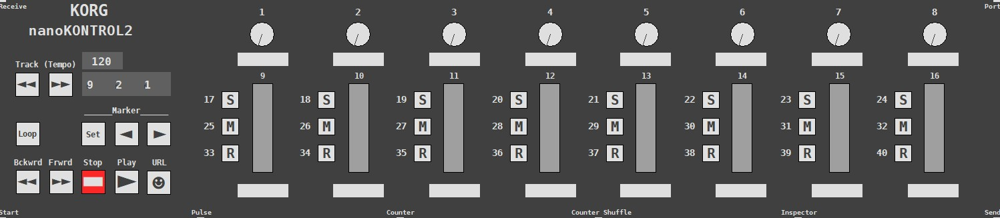

# [korg.nanokontrol2 nºport]
GOP abstraction form korg nanokontrol2 controller for plug and play use on Pure Data




 # 🎛️ Korg Nanokontrol 2 Abstraction for Pure Data

A Pure Data abstraction that replicates the interface of the **Korg Nanokontrol 2** MIDI controller using **Graph-On-Parent (GOP)** functionality. It allows intuitive, zero-patching control of elements in the parent patch, with instant visual feedback.

## 🚀 Features

- Plug-and-play control directly within the parent patch via GOP.
- Visual feedback in real-time.
- Sends and receives MIDI messages to/from the parent patch.
- Built-in **savestate system** for multiple independent instances.
- Single argument (`port number`) that matches your Pure Data MIDI settings.

## 🎚️ Usage

1. Open Pure Data and configure your desired MIDI port number in `Media > MIDI settings`.
2. Create an instance of the abstraction using the port number:
3. Send and receive data to/from parent patch using the method explains in the help patch.
   ```pd
   [korg.nanokontrol2 1]

## NOTE: Is neceessary to use the abs in conjunction with its respetive patch of the Korg Editor which is provided as well. 
